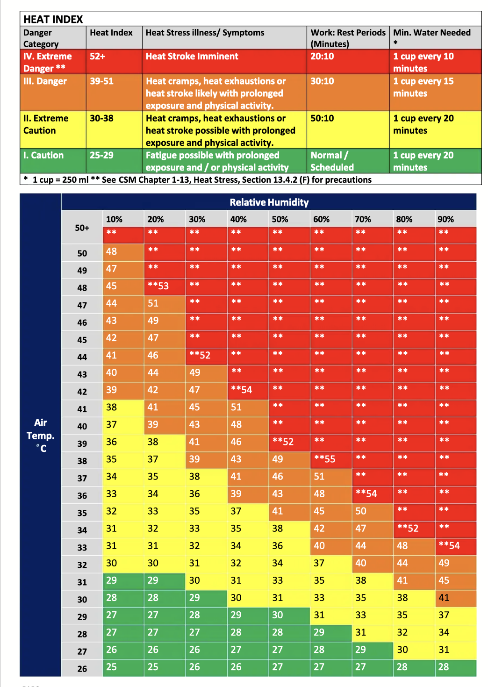

# Heat Stress Indication System

A MicroPython project running on a Raspberry Pi Pico that monitors real-time temperature and humidity, calculates the heat index, and displays alerts on an I2C LCD display.

## Overview

The system reads temperature and humidity from a DHT22 sensor, looks up the heat index from a reference table, and displays the current conditions alongside a danger level classification on a 16x2 LCD screen.

## Hardware

| Component | Details |
|---|---|
| Microcontroller | Raspberry Pi Pico |
| Sensor | DHT22 (Temperature & Humidity) |
| Display | 16x2 I2C LCD (address `0x27`) |

**Wiring:**
- DHT22 → GPIO Pin 4
- LCD SDA → GPIO Pin 0
- LCD SCL → GPIO Pin 1

## Alert Levels

## Setup

1. Flash MicroPython firmware to the Pico 2 W
   - Download: https://micropython.org/download/RPI_PICO2/
2. Copy `lcd_i2c.py` to the Pico root directory
   - Source: https://github.com/dhylands/python_lcd
3. Copy `main.py` to the Pico root directory
4. The script runs automatically on boot

## Notes

- `None` values in the heat index table represent off-chart combinations — treated automatically as Extreme Danger IV
- Sensor input is converted to integer and rounded to the nearest 10% humidity for table lookup
